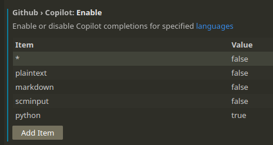

# Copilot Proxy Demo

A demo repo to show what Copilot sends to GitHub, inspired by https://code.kiwi.com/articles/cautiously-configuring-copilot/

## Man-in-the-Middle Proxy

Start the [mitmproxy](https://hub.docker.com/r/mitmproxy/mitmproxy/) container with the following command:

```bash
docker run --rm -it -v ~/.mitmproxy:/home/mitmproxy/.mitmproxy -p 8080:8080 mitmproxy/mitmproxy
```

This will open a window that shows you all traffic that goes through the proxy.

## Configure Copilot

Install the Copilot extension for your editor the way you usually do, and then configure the proxy settings.

### Vim/Neovim

1. Edit the `~/.vimrc` or `~/.config/nvim/init.vim` file
2. Add the following lines to tell Copilot to use the proxy and not care about SSL certificates:

```vim
let g:copilot_proxy = "http://127.0.0.1:8080"
let g:copilot_proxy_strict_ssl = v:false
```

### VSCodium

1. Open the settings with `Ctrl + ,`
2. Search for "proxy"
3. Enter `http://localhost:8081` as the `Http: Proxy` setting
4. Uncheck the `Http: Proxy Strict SSL` setting


## Editing files

Open a file in your editor and start editing. You should see the traffic in the mitmproxy window once you start typing in the file. By default, Copilot will be active on startup and for more or less all file types, and send the content of the file to the server every time you type a character. Check the lines with `HTTPS POST …ividual.githubcopilot.com /v1/engines/copilot-codex/completions` to see what is sent to the server.

As seen in `api_reader.bad.py`, Copilot will send the content of the file to the server, which contains the API key. This is a bad practice, as the API key should not be shared with anyone. 

```python
# Define the API endpoint
api_url = 'https://example-api.com/data'
api_key = 'SEUNiTMcpNyXKXnnaNTz70pe0kWm'
```

The `api_reader.better.py` file shows how to store the API key in a separate YAML file, which will prevent Copilot from sending the key to the server when just editing the Python file.

```python
# Read API key from the YAML file
with open('config.yaml', 'r') as file:
    config = yaml.safe_load(file)
api_key = config['api_key']
api_url = config['api_url']
```
The YAML file is added to the `.gitignore` file to avoid commiting the API key to the git repo. If you were to edit the YAML file though, Copilot would still send the content to the server, as it does not respect the `.gitignore` file.

## Suggestions

There are a couple of things you can do to imporve the security when using Copilot.

### Copilot disabled by default

By having Copilot disabled until you need it, you can avoid sending any content to the server when you are not actively using it.


#### Vim

This can be done by adding the following line to your `~/.vimrc`:

```vim
autocmd VimEnter * Copilot disable
```

and enabling it when you need it with `:Copilot enable`. You can also bind this to a key combination, for example:

```vim
" function to toggle copilot 
let g:copilot_enabled = 0 
function! ToggleCopilot()
    if exists("g:copilot_enabled") && g:copilot_enabled
        let g:copilot_enabled = 0 
        echo "Copilot disabled"
    else                                                                                      
        let g:copilot_enabled = 1 
        echo "Copilot enabled"
    endif
endfunction

" bind key to toggle function
nnoremap <F2> :call ToggleCopilot()<CR>                 
```

#### VSCodium

In VSCodium, you can press the small Copilot icon in the bottom right corner to enable/disable Copilot. I have not found a way to make it always disabled on startup, but you can at least disable it when you are not using it. The `POST` request will not be sent until you start writing in the file, so you can disable it before you start writing.

  
  

or create a keybind to toggle Copilot on and off.


### Copilot only enabled for specific file types

You can also configure Copilot to only be enabled for specific file types.

#### Vim

This can be done by adding the following line to your `~/.vimrc`:

```vim
" only enabled on whitelisted file types
let g:copilot_filetypes = {                                                                   
  \ '*': v:false,
  \ 'python': v:true,
  \ 'css': v:true,
  \ 'php': v:true,
  \ 'perl': v:true,
  \ 'markdown': v:true,
  \ 'go': v:true,
  \ 'html': v:true,
  \ 'java': v:true,
  \ 'javascript': v:true,
  \ 'julia': v:true
  \ }
```

This sets Copilot to be disabled for all file types, except for the ones listed in the dictionary. You can add or remove file types as you see fit. Avoid settings file types like YAML, JSON, or any other file type that contains sensitive information. Note that some files, like `.env` files, are recognized as `sh` files.

#### VSCodium

This is where the settings in VSCodium cause a bit of a problem. There does not seem to be a way to create a whitelist of file types where Copilot should be enabled, and simultaneously use the `Copilot enable/disable` button.

The setting to enable or disable Copilot is based on changing the setting for all file types (`*`). When it is set to `false`, Copilot is disabled for all file types. If there are any exceptions in the list of file types, the exceptions will have precedence. This means that if you have pressed your bound key to disable Copilot, Copilot is now disabled for all file types, but if you have an exception to have it enabled for Python, Copilot will still be enabled for Python files. If there had been a way to disable Copilot without changing the setting for all file types, this would have been a good way to only enable Copilot for specific file types.



There does seem to exist such a setting called `github.copilot.editor.enableAutoCompletions`, but I have not found a way to bind this to a key combination and make it toggle on and off. It is very likely that it is possible, but I simply do not know enough about VSCodium to do it. Using extensions you could probably create a macro that toggles this setting on and off, and bind that macro to a key combination, but that is outside the scope of this demo.


## VSCode vs VSCodium

Not connected to Copilot as such, but it is worth mentioning that VSCodium is a version of Visual Studio Code without the Microsoft branding and telemetry. It is a community-driven, freely-licensed binary distribution of Microsoft’s editor. There is a stark difference in the amount of permissions that the two editors require when installing the Copilot extension. VSCodium requires significantly fewer permissions than VSCode, which is a good thing if you are concerned about privacy.

VSCode permissions:  
  

VSCodium permissions:  


